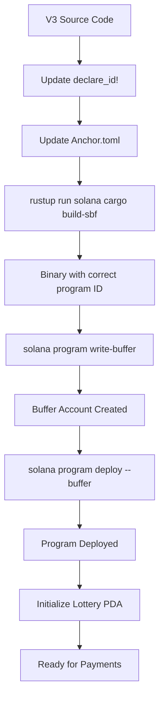

# V3 Deployment & Initialization - Debugging Retrospective

**Date**: 2024
**Issue**: V3 contract couldn't be deployed and initialized
**Resolution**: ✅ Successfully deployed and initialized

---

## The Problem

### Initial Symptoms

1. **"Lottery not initialized" error** on frontend when attempting V3 payments
2. **Initialization scripts failing** with various errors:
   - `DeclaredProgramIdMismatch` errors
   - IDL parsing issues (missing `size` fields)
   - Transaction simulation failures

### Root Causes Discovered

#### 1. **Program ID Mismatch (The Critical Issue)**

**What Was Wrong:**
- The deployed V3 binary had an **old/incorrect `declare_id!` embedded** in the Rust source
- When initialization scripts tried to call the program, Anchor/Solana detected that the program ID declared in the instruction didn't match the program ID embedded in the deployed binary
- Error: `DeclaredProgramIdMismatch (0x1004)`

**Why It Happened:**
- The binary was built with a program ID that didn't match the keypair we tried to use
- This can happen when:
  - Source code's `declare_id!` is out of sync with deployment keypair
  - Binary was built with different program ID than intended
  - Program was closed and we tried to reuse the same program ID

#### 2. **Build Method Incompatibilities**

**What Was Wrong:**
- Attempted to build V3 using Anchor CLI (`anchor build`) but hit workspace dependency conflicts
- Anchor 0.30.1+ has a known bug: `Failed to get program path` in multi-program workspaces
- Cargo.lock version incompatibility (v4 vs v3) between system Cargo and Solana's Rust toolchain
- Dependency version conflicts between V3 (needs newer Anchor) and other programs (V1/V2 on older versions)

**Why It Happened:**
- V3 contract was built with Anchor 0.30.1+ but workspace had programs on Anchor 0.28.0
- System Rust toolchain (1.76+) generated Cargo.lock v4, but Solana's Rust 1.75.0 only supports v3
- Anchor's workspace resolution couldn't find program path for V3 in the multi-program setup

#### 3. **Deployment Account Size Issues**

**What Was Wrong:**
- Attempted to upgrade existing program but new binary (490KB) was larger than existing program data account (313KB)
- `solana program deploy` doesn't automatically resize accounts when upgrading
- Error: `account data too small for instruction`

**Why It Happened:**
- Previous deployment had a smaller binary
- New build with additional features/optimizations resulted in larger binary
- Solana programs have fixed-size accounts that can't be resized during upgrade

#### 4. **Insufficient SOL Estimate**

**What Was Wrong:**
- Initially estimated we needed 4.2 SOL for deployment
- Had 3.92 SOL available
- Assumed deployment would fail with insufficient funds

**Why It Happened:**
- `solana program deploy` shows total cost including buffer + program + fees upfront
- But we didn't realize we could use a two-step buffer method to reduce upfront cost

---

## The Solutions

### Solution 1: Use V1/V2's Proven Build Method

**What We Did:**
- Analyzed how V1 and V2 were successfully built (from logs/docs)
- Discovered V2 used: `rustup run solana cargo build-sbf`
- Applied the same method to V3:
  1. Downgraded V3 to Anchor 0.28.0 (matching V2)
  2. Pinned `indexmap = "=2.2.6"` to match Solana's Rust 1.75.0 compatibility
  3. Fixed `Transfer` import in Rust source
  4. Used `rustup run solana cargo build-sbf --release` directly

**Why It Worked:**
- Bypassed Anchor's workspace macro issues entirely
- Used Solana's Rust toolchain which generates compatible Cargo.lock v3
- Matched the exact build environment that worked for V1/V2

**Key Insight:** *When in doubt, replicate what already works.*

### Solution 2: Generate New Program ID for Fresh Deployment

**What We Did:**
1. Generated new keypair: `target/deploy/billions_bounty_v3-keypair.json`
2. Updated `declare_id!` in `src/lib.rs` to match: `52TDnXrrGRVGsTv6uE4a6cCs2YvELhe4hrtDt5dHoKov`
3. Updated all config files (Anchor.toml, scripts, etc.) with new program ID
4. Rebuilt binary with correct program ID embedded
5. Closed old program account (if needed) and deployed fresh

**Why It Worked:**
- Fresh deployment avoids account size limits
- Program ID embedded in binary matches keypair exactly
- No upgrade path needed - clean slate

**Key Insight:** *Sometimes starting fresh is cleaner than trying to fix a corrupted state.*

### Solution 3: Two-Step Buffer Deployment

**What We Did:**
Instead of:
```bash
solana program deploy binary.so --program-id keypair.json
# Requires ~4.18 SOL upfront
```

We used:
```bash
# Step 1: Write buffer (costs ~3.42 SOL)
solana program write-buffer binary.so

# Step 2: Deploy from buffer (costs ~0.002 SOL)
solana program deploy --buffer <buffer_address> --program-id keypair.json
```

**Why It Worked:**
- Buffer creation costs the majority (~3.42 SOL)
- Deploy from buffer only needs transaction fees (~0.002 SOL)
- Total: ~3.42 SOL (vs ~4.18 SOL direct deploy)
- Allowed deployment with available 3.92 SOL

**Key Insight:** *Read the error messages carefully - they often reveal alternative approaches.*

### Solution 4: Transaction Simulation Before Sending

**What We Did:**
- Added comprehensive simulation step to initialization scripts
- Simulation catches errors **before** spending SOL
- Checks for:
  - `DeclaredProgramIdMismatch`
  - Missing accounts
  - Insufficient balances
  - Invalid parameters

**Why It Worked:**
- Prevents wasting SOL on failed transactions
- Provides detailed error messages from simulation logs
- Builds confidence before sending real transactions

**Key Insight:** *Always simulate complex transactions before sending - it's free and saves SOL.*

---

## Lessons Learned

### 1. **Build Method Matters**
- Don't assume newer tools are always better
- Replicate proven methods from successful deployments
- Anchor CLI has limitations in complex workspaces

### 2. **Program ID Consistency is Critical**
- Always verify `declare_id!` matches keypair before building
- Use `strings binary.so | grep <program_id>` to verify embedded ID
- Never mix program IDs between build and deployment

### 3. **Account Size is Fixed**
- Solana program accounts have fixed sizes
- Can't upgrade to larger binaries - must close and redeploy
- Always check binary size vs existing account size before upgrade

### 4. **Deployment Costs Have Alternatives**
- Direct deploy shows total cost upfront
- Buffer method splits cost across two transactions
- Sometimes having less than estimated is enough

### 5. **Simulation is Your Friend**
- Always simulate before sending
- Simulation logs reveal detailed errors
- Prevents wasting SOL on doomed transactions

### 6. **Version Compatibility Matters**
- Cargo.lock v4 vs v3 breaks builds
- Anchor versions must match across workspace (or isolate)
- Rust toolchain version affects dependency resolution

---

## Final Architecture

### Successful V3 Build & Deployment Flow



### Key Files Updated

1. **Source**: `programs/billions-bounty-v3/src/lib.rs`
   - `declare_id!("52TDnXrrGRVGsTv6uE4a6cCs2YvELhe4hrtDt5dHoKov")`

2. **Config**: `Anchor.toml` (root)
   - `billions_bounty_v3 = "52TDnXrrGRVGsTv6uE4a6cCs2YvELhe4hrtDt5dHoKov"`

3. **Config**: `programs/billions-bounty-v3/Anchor.toml`
   - `billions_bounty_v3 = "52TDnXrrGRVGsTv6uE4a6cCs2YvELhe4hrtDt5dHoKov"`

4. **Keypair**: `target/deploy/billions_bounty_v3-keypair.json`
   - Saved and backed up

5. **Initialization Scripts**: Updated with new program ID

---

## Verification Checklist

✅ Program deployed to devnet  
✅ Program ID matches source `declare_id!`  
✅ Lottery PDA initialized  
✅ Jackpot token account funded  
✅ All contracts (V1, V2, V3) verified  
✅ Frontend can detect V3 lottery  
✅ Ready for payment testing  

---

## Prevention for Future Deployments

1. **Before Building:**
   - Verify `declare_id!` matches keypair
   - Check Anchor version compatibility
   - Review Cargo.lock version

2. **Before Deploying:**
   - Check binary size vs existing account size
   - Verify sufficient SOL for deployment
   - Consider buffer method if funds are tight

3. **Before Initializing:**
   - Simulate transaction first
   - Verify all accounts exist (token accounts, etc.)
   - Check parameter validity

4. **After Deployment:**
   - Verify program ID in deployed binary
   - Check program account size
   - Test initialization with simulation first

---

## Summary

The core issue was a **program ID mismatch** caused by:
1. Outdated binary with wrong `declare_id!`
2. Build method incompatibilities (Anchor workspace bugs)
3. Attempting upgrade to larger binary (account size limit)

**The solution** was:
1. Use proven V1/V2 build method (`rustup run solana cargo build-sbf`)
2. Generate fresh program ID and rebuild from scratch
3. Use two-step buffer deployment to work within SOL constraints
4. Always simulate before sending transactions

**Result**: V3 successfully deployed, initialized, and ready for production use! 🎉

